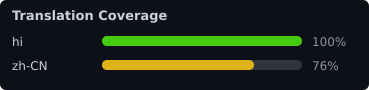

# Dioxamine


**Dioxamine** lets you run **ADB**, **Scrcpy**, and **Fastboot** directly from your Android phone or tablet. Connect another device via USB OTG or [Wireless ADB (Wi-Fi)](https://rhythmcache.github.io/Dioxamine/book/user-guide/connecting-devices.html) to mirror screens with full touch control, flash partitions, sideload, unlock bootloaders, manage files and apps, or run custom plugins. No PC or root required.

<table align="center">
  <tr>
    <th align="center">ADB Tools</th>
    <th align="center">Process Telemetry</th>
    <th align="center">Screen Mirroring</th>
    <th align="center">Fastboot Flasher</th>
    <th align="center">App Settings</th>
  </tr>
  <tr>
    <td align="center"></td>
    <td align="center"></td>
    <td align="center"></td>
    <td align="center"></td>
    <td align="center"></td>
  </tr>
</table>

<p align="center">
  <a href="SCREENSHOTS.md"><b>📸 View Full Screenshots Gallery (All 12 Features) →</b></a>
</p>

It focuses on:

 - **PC-free control**: full ADB, Fastboot, and Scrcpy client running phone-to-phone
 - **flashing & recovery**: flash images, live-boot recoveries/kernels, and unlock bootloaders over USB OTG
 - **non-intrusiveness**: no root or client app needed on the connected device
 - **extensibility**: build and install custom tools with the HTML/JS plugin engine

## Features

### Scrcpy Screen Mirroring and Audio
- [Real-time display mirroring](https://rhythmcache.github.io/Dioxamine/book/user-guide/scrcpy-mirroring/screen-mirroring.html) with full multi-touch and hardware key control
- [Audio forwarding](https://rhythmcache.github.io/Dioxamine/book/user-guide/scrcpy-mirroring/settings-tuning.html) (Android 11+)
- [Camera streaming](https://rhythmcache.github.io/Dioxamine/book/user-guide/scrcpy-mirroring/camera-streaming.html) (Android 12+; front and rear cameras, flashlight/torch toggle, high-FPS modes)
- [Mirroring with target screen off](https://rhythmcache.github.io/Dioxamine/book/user-guide/scrcpy-mirroring/screen-mirroring.html) (saves battery and reduces heat)
- [Touchpad & PC keyboard mode](https://rhythmcache.github.io/Dioxamine/book/user-guide/adb-tools/touchpad-keyboard.html) via UHID simulation
- Configurable codecs (**H.264**, **H.265 / HEVC**, **AV1**), bitrate, resolution, and FPS

### Fastboot Flasher and Bootloader Tools (USB OTG)
- [Flash partition images](https://rhythmcache.github.io/Dioxamine/book/user-guide/fastboot/flashing-images.html) (`boot`, `recovery`, `vendor_boot`, `init_boot`, `system`, etc.)
- [Live boot images](https://rhythmcache.github.io/Dioxamine/book/user-guide/fastboot/boot-image.html) (`fastboot boot <image>`) to test custom kernels or recoveries without flashing
- [Unlock & lock bootloader](https://rhythmcache.github.io/Dioxamine/book/user-guide/fastboot/lock-bootloader.html) state directly from your phone
- [Variable inspector](https://rhythmcache.github.io/Dioxamine/book/user-guide/fastboot/variables.html) (`getvar all`, check current slot A/B)
- [Interactive Fastboot shell](https://rhythmcache.github.io/Dioxamine/book/user-guide/fastboot/fastboot-shell.html) for raw commands

### ADB Management and Diagnostics
- [Process manager](https://rhythmcache.github.io/Dioxamine/book/user-guide/adb-tools/process-manager.html): live CPU & RAM usage telemetry, process inspector, search filter, Force Stop, and PID termination
- [Miscellaneous tools](https://rhythmcache.github.io/Dioxamine/book/user-guide/adb-tools/miscellaneous.html): display density (DPI) & resolution changer, screen orientation, stay awake, demo mode, touch visualization, window animation scale, battery emulation, and deep link URL launcher
- [File manager](https://rhythmcache.github.io/Dioxamine/book/user-guide/adb-tools/file-manager.html): browse target filesystem, upload, download, and manage storage
- [Package manager](https://rhythmcache.github.io/Dioxamine/book/user-guide/adb-tools/package-manager.html): install split APKs, debloat/disable system apps, extract and pull APKs
- [Reboot menu](https://rhythmcache.github.io/Dioxamine/book/user-guide/adb-tools/reboot-menu.html): one-tap reboot to System, Recovery, Bootloader, FastbootD, EDL, or Power Off
- [Sideload & rescue](https://rhythmcache.github.io/Dioxamine/book/user-guide/adb-tools/sideload-rescue.html): flash OTA packages (`.zip`) via `adb sideload` or restore bricked devices
- [Screenshot capture](https://rhythmcache.github.io/Dioxamine/book/user-guide/adb-tools/screenshots.html): take high-res screenshots pulled directly from the target frame buffer
- [Interactive ADB shell](https://rhythmcache.github.io/Dioxamine/book/user-guide/adb-tools/terminal-shell.html)

### Custom Plugin Engine
- Run custom modular tools built with HTML5, CSS, and JavaScript inside a sandboxed WebView
- Direct JavaScript Bridge API for shell commands, file push/pull, port forwarding, and Material 3 theming
- Install third-party `.zip` plugins or build your own
- Check out the [Terminal Plugin](https://github.com/rhythmcache/Terminal) or read the [Plugin Development Guide](https://rhythmcache.github.io/Dioxamine/book/plugins/overview.html)

## Prerequisites

- **Host Device**: Android 7.0+ (API 24+)
- **Target Device**: Android 5.0+ (API 21+)
  - Audio forwarding requires Android 11+ (API 30+)
  - Camera streaming requires Android 12+ (API 31+)
  - Wireless ADB QR code pairing requires Android 11+ (API 30+)

Make sure [USB debugging](https://developer.android.com/studio/debug/dev-options#enable) is enabled on the target device.

On **Xiaomi / HyperOS / MIUI** devices, you must also enable **USB debugging (Security Settings)** in Developer Options to allow touch control and input injection.

## Documentation

Full documentation, guides, and API specifications are available in the [Dioxamine Book](https://rhythmcache.github.io/Dioxamine/book/):

- **User Guide**
  - [Connecting Devices (USB OTG, Wireless ADB, QR Pairing)](https://rhythmcache.github.io/Dioxamine/book/user-guide/connecting-devices.html)
  - [OEM Setup & Troubleshooting](https://rhythmcache.github.io/Dioxamine/book/user-guide/oem-setup.html)
  - [ADB Built-in Tools](https://rhythmcache.github.io/Dioxamine/book/user-guide/adb-tools/overview.html)
  - [Scrcpy Screen Mirroring & Audio](https://rhythmcache.github.io/Dioxamine/book/user-guide/scrcpy-mirroring/screen-mirroring.html)
  - [Fastboot Tools](https://rhythmcache.github.io/Dioxamine/book/user-guide/fastboot/getting-started.html)
- **Plugin Development**
  - [Plugin Overview & Architecture](https://rhythmcache.github.io/Dioxamine/book/plugins/overview.html)
  - [Quickstart Guide](https://rhythmcache.github.io/Dioxamine/book/plugins/quickstart.html)
  - [Manifest Specification (`plugin.json`)](https://rhythmcache.github.io/Dioxamine/book/plugins/manifest.html)
  - [JavaScript Bridge API Reference](https://rhythmcache.github.io/Dioxamine/book/plugins/api-reference.html)

## Build instructions

Clone the repository recursively (to include the embedded `scrcpy` submodule):

```bash
git clone --depth 1 --recurse-submodules https://github.com/rhythmcache/Dioxamine.git
cd Dioxamine
export JAVA_HOME=/path/to/java
export ANDROID_NDK_ROOT=/path/to/android/ndk
./gradlew assembleDebug
```

Requirements:
- JDK 17+
- Android SDK (API 37)
- Android NDK (`ANDROID_NDK_HOME` set)

## Contributing

Contributions are welcome! If you would like to contribute code, report bugs, or help translate Dioxamine into your language, feel free to open an issue or pull request.

### Translations

We want Dioxamine to be accessible in as many languages as possible.

- [x] English (`en`) - default
- [x] Simplified Chinese (`zh-CN`) - @riyousa
- [x] Hindi (`hi`) - @rhythmcache





<!-- Contributors: Add your language checkmark below when submitting a translation -->

### 🌐 How to Add a Language Translation

#### 1. Fork & Clone
Fork this repository and clone your fork locally:
```bash
git clone https://github.com/<your-username>/Dioxamine.git
cd Dioxamine
git checkout -b translate-<language>
```

#### 2. Create the Translation File
1. Create a new folder under `app/src/main/res/`:
   ```bash
   app/src/main/res/values-<locale>/
   ```
   *(e.g., `values-es` for Spanish, `values-ru` for Russian, `values-zh-rCN` for Simplified Chinese, `values-pt-rBR` for Brazilian Portuguese)*
2. Copy the base strings from [`app/src/main/res/values/strings.xml`](app/src/main/res/values/strings.xml) into your new folder: `app/src/main/res/values-<locale>/strings.xml`.
3. Translate the strings inside `<string name="...">Your Translation</string>`.
   > **Note:**
   > - Keep placeholders like `%s`, `%d`, `%1$s`, HTML tags, and XML entities (`&amp;`, `\'`) unchanged.
   > - **AI / LLM Translations:** Using LLMs (e.g. ChatGPT, Claude, Gemini) to assist or draft translations is totally allowed! However, please **manually review and refine the output**. LLMs often generate overly formal, archaic, or literal translations that aren't commonly spoken in daily conversation or standard mobile apps. Please adapt the phrasing so it feels natural, casual, and intuitive for native speakers.

#### 3. Register Your Language in Code
1. In [`app/src/main/res/values/strings.xml`](app/src/main/res/values/strings.xml), add a string resource for your language's native name (endonym) with `translatable="false"` (do not translate it in other language folders):
   ```xml
   <string name="settings_language_spanish" translatable="false">Español</string>
   ```
2. In [`app/src/main/kotlin/io/github/rhythmcache/dioxamine/settings/SupportedLanguages.kt`](app/src/main/kotlin/io/github/rhythmcache/dioxamine/settings/SupportedLanguages.kt), add an entry to the `supportedLanguages` list:
   ```kotlin
   LanguageOption(R.string.settings_language_spanish, "es"),
   ```

#### 4. Add Checkmark in README & Open PR
1. Under the **Translations** section above in `README.md`, add your language checkmark:
   ```markdown
   - [x] Spanish (`es`) - @your-github-username
   ```
2. Commit your changes, push to your fork, and submit a **Pull Request**:
   ```bash
   git add .
   git commit -m "i18n: add Spanish translation"
   git push origin translate-spanish
   ```

## Backends used by this project

- [rhythmcache/adb-kt](https://github.com/rhythmcache/adb-kt)
- [rhythmcache/fastboot-kt](https://github.com/rhythmcache/fastboot-kt)
- [Genymobile/scrcpy](https://github.com/Genymobile/scrcpy)


## Community

- **Telegram Channel**: [t.me/tr1ple_fault](https://t.me/tr1ple_fault)
- **Issues & Suggestions**: [GitHub Issues](https://github.com/rhythmcache/Dioxamine/issues)

## License

    Copyright (C) 2026 rhythmcache

    Licensed under the Apache License, Version 2.0 (the "License");
    you may not use this file except in compliance with the License.
    You may obtain a copy of the License at

        http://www.apache.org/licenses/LICENSE-2.0

    Unless required by applicable law or agreed to in writing, software
    distributed under the License is distributed on an "AS IS" BASIS,
    WITHOUT WARRANTIES OR CONDITIONS OF ANY KIND, either express or implied.
    See the License for the specific language governing permissions and
    limitations under the License.

