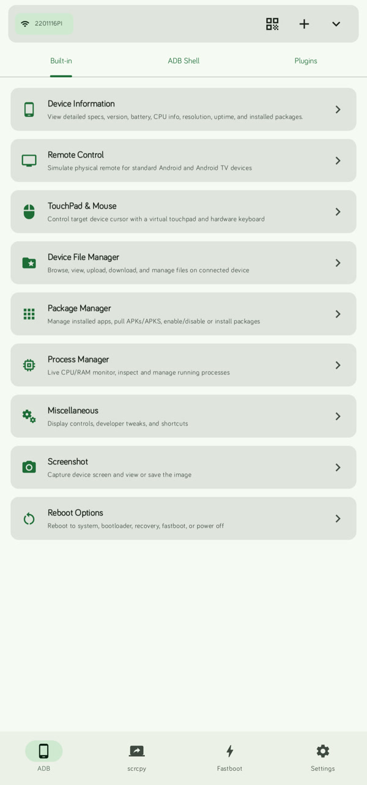
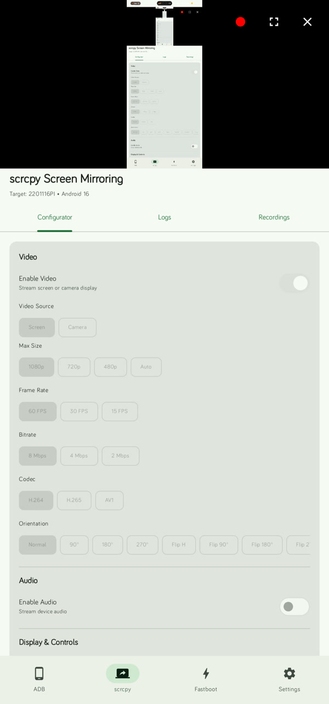
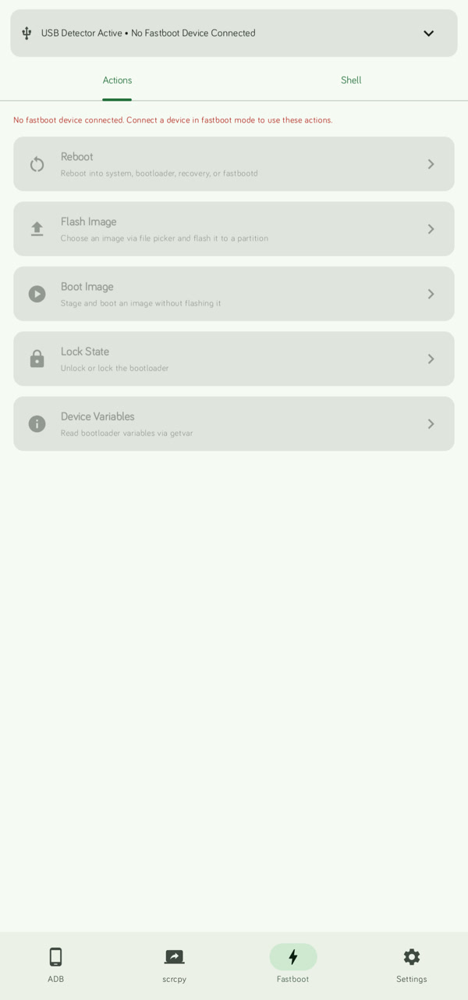
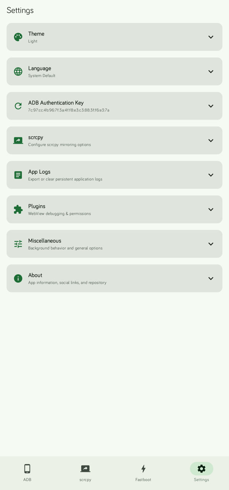

# Dioxamine 简体中文版


**Dioxamine** 可以让 Android 手机或平板直接作为 **ADB**、**Scrcpy** 和 **Fastboot** 主机使用。通过 USB OTG 或[无线 ADB（Wi-Fi）](https://rhythmcache.github.io/Dioxamine/book/user-guide/connecting-devices.html)连接另一台 Android 设备后，即可投屏并进行触控、刷写分区、旁加载更新、解锁 Bootloader、管理文件和应用，或运行自定义插件；无需电脑，也无需 Root。

> [!IMPORTANT]
> 本仓库是 [rhythmcache/Dioxamine](https://github.com/rhythmcache/Dioxamine) 的非官方简体中文本地化版本。核心功能、项目名称及原始版权归原项目及其贡献者所有；简体中文翻译和本地化适配由 [riyousa](https://github.com/riyousa) 维护。英文说明、完整文档及最新上游开发进展请以[原项目](https://github.com/rhythmcache/Dioxamine)为准。

<p align="center">
  
  &nbsp;
  
  &nbsp;
  
  &nbsp;
  
</p>

这个项目专注于：

- **脱离电脑操作**：在手机之间直接使用完整的 ADB、Fastboot 和 Scrcpy 功能
- **刷写与救援**：通过 USB OTG 刷写镜像、临时启动 Recovery/内核以及解锁 Bootloader
- **低侵入性**：被控设备无需 Root，也无需安装客户端应用
- **可扩展性**：使用 HTML/JavaScript 插件引擎构建和安装自定义工具

## 简体中文本地化

- 可在“设置 → 语言”中选择“简体中文”，也可跟随系统语言
- 已覆盖主要界面、对话框、操作提示、无障碍描述及 Fastlane 商店元数据
- 保留英文资源作为默认语言，缺失翻译时会自动回退到英文
- 翻译相关问题请提交到[本仓库 Issues](https://github.com/riyousa/Dioxamine/issues)；核心功能问题可先查阅[原项目 Issues](https://github.com/rhythmcache/Dioxamine/issues)

## 功能

### Scrcpy 屏幕镜像与音频

- [实时屏幕镜像](https://rhythmcache.github.io/Dioxamine/book/user-guide/scrcpy-mirroring/screen-mirroring.html)，支持完整的多点触控和硬件按键控制
- [音频转发](https://rhythmcache.github.io/Dioxamine/book/user-guide/scrcpy-mirroring/settings-tuning.html)（Android 11 及以上）
- [摄像头串流](https://rhythmcache.github.io/Dioxamine/book/user-guide/scrcpy-mirroring/camera-streaming.html)，支持前后摄像头、闪光灯和高帧率模式
- [关闭目标设备屏幕时继续镜像](https://rhythmcache.github.io/Dioxamine/book/user-guide/scrcpy-mirroring/screen-mirroring.html)，以降低耗电和发热
- 通过 UHID 模拟实现[触控板和电脑键盘模式](https://rhythmcache.github.io/Dioxamine/book/user-guide/adb-tools/touchpad-keyboard.html)
- 可配置 **H.264**、**H.265/HEVC**、**AV1** 编解码器，以及码率、分辨率和帧率

### Fastboot 刷写与 Bootloader 工具（USB OTG）

- [刷写分区镜像](https://rhythmcache.github.io/Dioxamine/book/user-guide/fastboot/flashing-images.html)，例如 `boot`、`recovery`、`vendor_boot`、`init_boot` 和 `system`
- 使用 `fastboot boot <镜像>` [临时启动镜像](https://rhythmcache.github.io/Dioxamine/book/user-guide/fastboot/boot-image.html)，无需刷入即可测试自定义内核或 Recovery
- 直接在手机上[解锁或重新锁定 Bootloader](https://rhythmcache.github.io/Dioxamine/book/user-guide/fastboot/lock-bootloader.html)
- 使用[变量查看器](https://rhythmcache.github.io/Dioxamine/book/user-guide/fastboot/variables.html)执行 `getvar all`、检查当前 A/B 槽位等信息
- 通过[交互式 Fastboot Shell](https://rhythmcache.github.io/Dioxamine/book/user-guide/fastboot/fastboot-shell.html)运行原始命令

### ADB 管理与诊断

- [文件管理器](https://rhythmcache.github.io/Dioxamine/book/user-guide/adb-tools/file-manager.html)：浏览目标文件系统，上传、下载和管理文件
- [应用管理器](https://rhythmcache.github.io/Dioxamine/book/user-guide/adb-tools/package-manager.html)：安装拆分 APK、停用系统应用，以及提取 APK
- [重启菜单](https://rhythmcache.github.io/Dioxamine/book/user-guide/adb-tools/reboot-menu.html)：一键重启至系统、Recovery、Bootloader、FastbootD、EDL，或关机
- [旁加载与设备救援](https://rhythmcache.github.io/Dioxamine/book/user-guide/adb-tools/sideload-rescue.html)：使用 `adb sideload` 刷入 OTA 包（`.zip`）或尝试恢复无法正常启动的设备
- [屏幕截图](https://rhythmcache.github.io/Dioxamine/book/user-guide/adb-tools/screenshots.html)：直接从目标设备捕获并拉取高分辨率截图
- [交互式 ADB Shell](https://rhythmcache.github.io/Dioxamine/book/user-guide/adb-tools/terminal-shell.html)

### 自定义插件引擎

- 在沙盒 WebView 中运行使用 HTML5、CSS 和 JavaScript 构建的模块化工具
- JavaScript Bridge API 支持 Shell 命令、文件推送/拉取、端口转发和 Material 3 主题
- 支持安装第三方 `.zip` 插件，也可以自行开发插件
- 可查看原项目的 [Terminal 插件](https://github.com/rhythmcache/Terminal)和[插件开发指南](https://rhythmcache.github.io/Dioxamine/book/plugins/overview.html)

## 使用要求

- **主控设备**：Android 7.0 及以上（API 24+）
- **目标设备**：Android 5.0 及以上（API 21+）
  - 音频转发需要 Android 11 及以上（API 30+）
  - 无线 ADB 二维码配对需要 Android 11 及以上（API 30+）

请先在目标设备上启用 [USB 调试](https://developer.android.com/studio/debug/dev-options#enable)。

在 **小米 / HyperOS / MIUI** 设备上，还需要在开发者选项中启用“**USB 调试（安全设置）**”，否则可能无法使用触控和输入注入功能。

> [!CAUTION]
> 刷写镜像、解锁 Bootloader、停用系统应用等操作可能导致数据丢失或设备无法启动。请确认文件和目标分区正确，并提前备份重要数据。

## 文档

完整使用指南和 API 说明由原项目维护，目前以英文为主：

- **用户指南**
  - [连接设备（USB OTG、无线 ADB、二维码配对）](https://rhythmcache.github.io/Dioxamine/book/user-guide/connecting-devices.html)
  - [厂商设置与故障排除](https://rhythmcache.github.io/Dioxamine/book/user-guide/oem-setup.html)
  - [ADB 内置工具](https://rhythmcache.github.io/Dioxamine/book/user-guide/adb-tools/overview.html)
  - [Scrcpy 屏幕镜像与音频](https://rhythmcache.github.io/Dioxamine/book/user-guide/scrcpy-mirroring/screen-mirroring.html)
  - [Fastboot 工具](https://rhythmcache.github.io/Dioxamine/book/user-guide/fastboot/getting-started.html)
- **插件开发**
  - [插件概述与架构](https://rhythmcache.github.io/Dioxamine/book/plugins/overview.html)
  - [快速入门](https://rhythmcache.github.io/Dioxamine/book/plugins/quickstart.html)
  - [`plugin.json` 清单规范](https://rhythmcache.github.io/Dioxamine/book/plugins/manifest.html)
  - [JavaScript Bridge API 参考](https://rhythmcache.github.io/Dioxamine/book/plugins/api-reference.html)

## 构建

递归克隆本仓库，以同时获取内嵌的 `scrcpy` 子模块：

```bash
git clone --recursive https://github.com/riyousa/Dioxamine.git
cd Dioxamine
bash gradlew assembleDebug
```

构建环境要求：

- JDK 17+
- Android SDK（API 37）
- Android NDK，并已设置 `ANDROID_NDK_HOME`

若要参与原项目开发或获取尚未同步的最新功能，请使用[上游仓库](https://github.com/rhythmcache/Dioxamine)。

## 社区与问题反馈

- **中文翻译问题**：[本地化仓库 Issues](https://github.com/riyousa/Dioxamine/issues)
- **原项目 Telegram 频道**：[t.me/tr1ple_fault](https://t.me/tr1ple_fault)
- **核心功能问题与建议**：[原项目 Issues](https://github.com/rhythmcache/Dioxamine/issues)

## 项目来源与致谢

本地化版本基于 [rhythmcache/Dioxamine](https://github.com/rhythmcache/Dioxamine) 修改，感谢原作者 **rhythmcache** 及所有上游贡献者开发和维护 Dioxamine。上游项目使用的 ADB、Fastboot、Scrcpy 及其他第三方组件，其版权和许可归各自作者所有。

- **原项目与核心开发**：[rhythmcache/Dioxamine](https://github.com/rhythmcache/Dioxamine)
- **简体中文本地化**：[riyousa/Dioxamine](https://github.com/riyousa/Dioxamine)
- **原项目文档**：[Dioxamine Book](https://rhythmcache.github.io/Dioxamine/book/)

## 许可证

本项目沿用原项目的 [Apache License 2.0](LICENSE)。原始版权声明予以保留：

```text
Copyright (C) 2026 rhythmcache
```

本地化修改同样依照 Apache License 2.0 提供，且不附带任何明示或暗示的担保。
