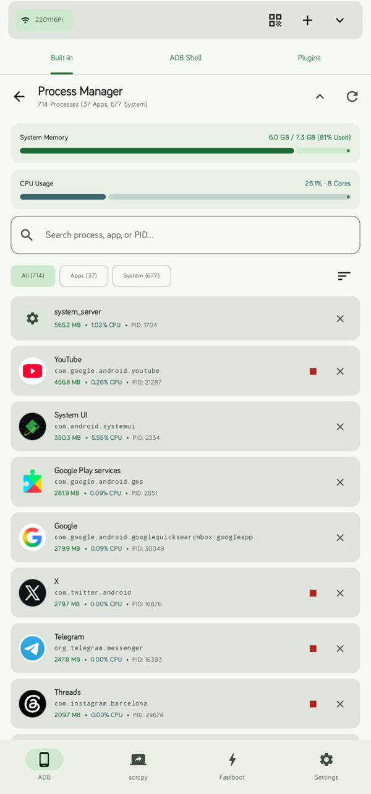
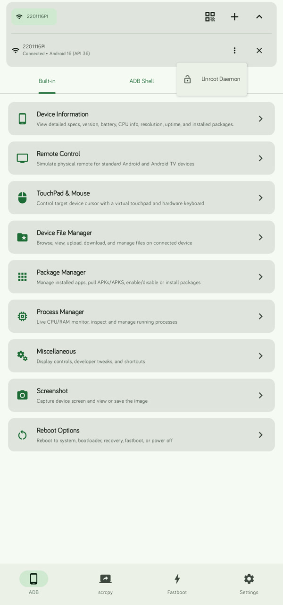
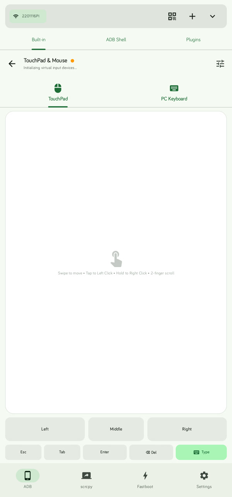
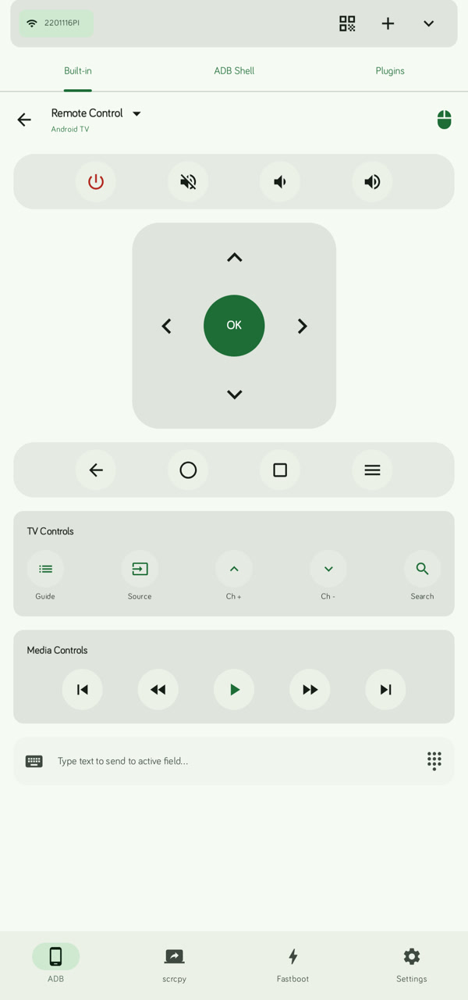
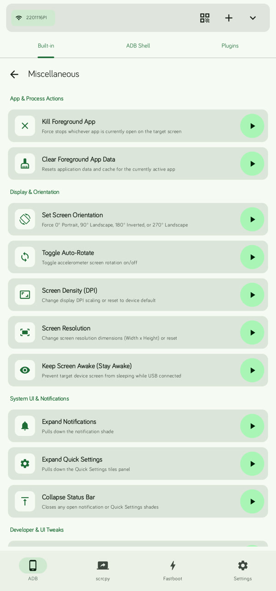
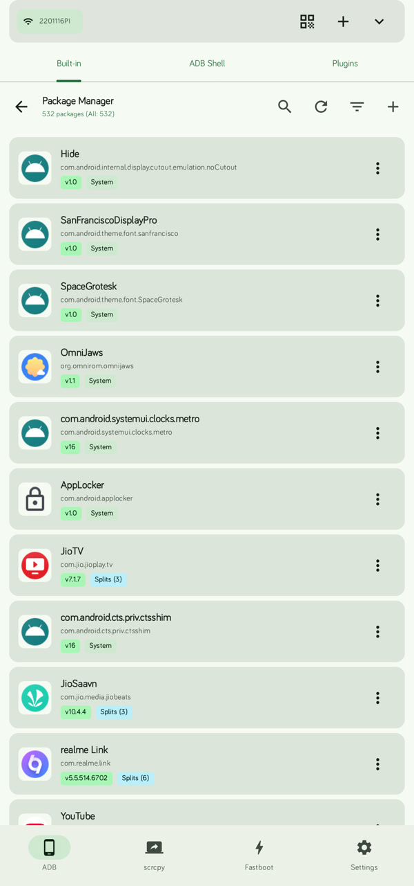
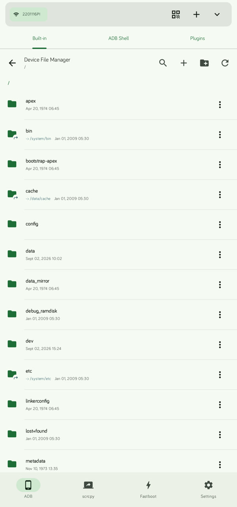
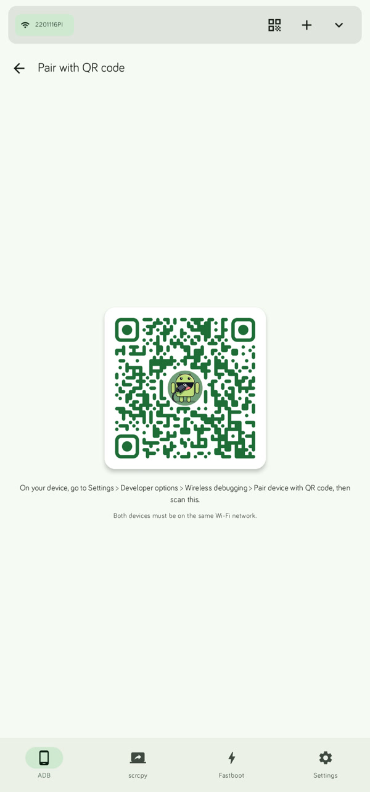

# 📸 Dioxamine Screenshots Gallery

[← Back to README](README.md)

Explore the complete set of screenshots showcasing the latest Material You interface, real-time diagnostics, phone-to-phone control, and developer utilities in **Dioxamine**.

---

## 📱 Core & System Telemetry

<table align=center>
  <tr>
    <th align=center>ADB Built-in Tools</th>
    <th align=center>Process Manager & Telemetry</th>
    <th align=center>ADB Daemon Controls</th>
  </tr>
  <tr>
    <td align=center></td>
    <td align=center></td>
    <td align=center></td>
  </tr>
  <tr>
    <td align=center>Central hub for device diagnostics, remote control, and system options.</td>
    <td align=center>Live RAM & CPU usage graphs with per-process termination and force stop.</td>
    <td align=center>Quick device status, connection details, and ADB daemon unroot controls.</td>
  </tr>
</table>

---

## 🖥️ Screen Mirroring & Remote Input

<table align=center>
  <tr>
    <th align=center>Scrcpy Mirroring & Config</th>
    <th align=center>TouchPad & PC Keyboard</th>
    <th align=center>Android TV Remote</th>
  </tr>
  <tr>
    <td align=center></td>
    <td align=center></td>
    <td align=center></td>
  </tr>
  <tr>
    <td align=center>Low-latency display stream with camera switching, AV1/H.265/H.264 codecs, and audio forwarding.</td>
    <td align=center>Simulate mouse trackpad gestures, clicks, and physical PC keyboard keys via UHID.</td>
    <td align=center>Dedicated D-Pad, TV playback controls, volume keys, and direct text input injection.</td>
  </tr>
</table>

---

## 🧰 Management & System Tweaks

<table align=center>
  <tr>
    <th align=center>Miscellaneous ADB Tools</th>
    <th align=center>Package Manager</th>
    <th align=center>Device File Manager</th>
  </tr>
  <tr>
    <td align=center></td>
    <td align=center></td>
    <td align=center></td>
  </tr>
  <tr>
    <td align=center>Modify screen DPI & resolution, toggle stay-awake, kill foreground apps, and control status bar.</td>
    <td align=center>Debloat, disable, extract APKs, and inspect split-APK packages with search & filters.</td>
    <td align=center>Full root/internal storage file explorer to browse, pull, and push files over ADB.</td>
  </tr>
</table>

---

## ⚡ Fastboot, Wireless Pairing & Settings

<table align=center>
  <tr>
    <th align=center>Fastboot Mode & Flasher</th>
    <th align=center>Wireless ADB QR Pairing</th>
    <th align=center>Application Settings</th>
  </tr>
  <tr>
    <td align=center></td>
    <td align=center></td>
    <td align=center></td>
  </tr>
  <tr>
    <td align=center>One-tap bootloader actions: flash partitions, live boot kernels/recoveries, unlock OEM state.</td>
    <td align=center>Instant wireless pairing using Android 11+ Developer Options QR scanner.</td>
    <td align=center>Monet dynamic theming, custom languages, key management, and plugin engine settings.</td>
  </tr>
</table>

---

[← Back to README](README.md)
